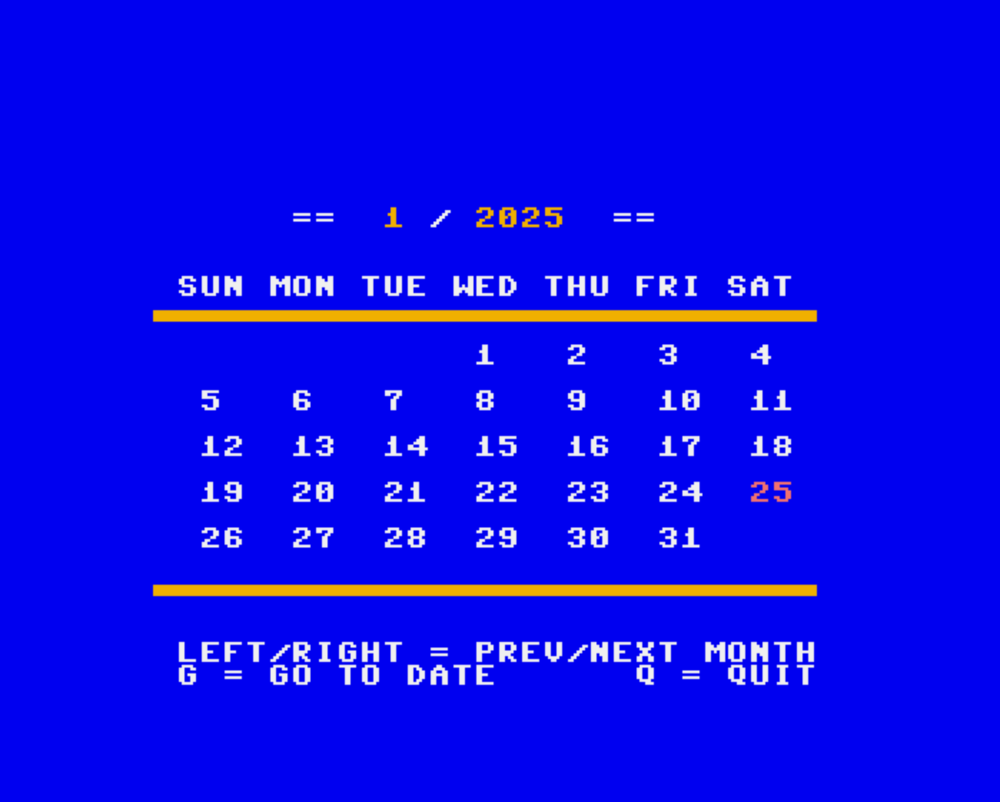

# cal(endar) for Mega65
A simple perpetual calendar for the Mega65 developed with the Eleven Development Environment [https://github.com/MEGA65/eleven](https://github.com/MEGA65/eleven).

## Files
Here is a short description of each file of the repository:
* **cal.el:** The eleven source code of the calendar  
* **cal.elpc:** The eleven source code converted to be readable on other computers (more info in the notes below)
* **cal.prg:** The Mega65 executable

## Keys
* **left/right key:** Go to previous/next month
* **G:** Go to a given date (asks for target month and year)
* **Q:** Quit


## Screenshot


## Note
Command used to convert **cal.el** to **cal.elpc** :
```
petcat -65 -o cal.elpc -- cal.el
```
(the petcat command is part of the [VICE emulator](https://vice-emu.sourceforge.io) package)
